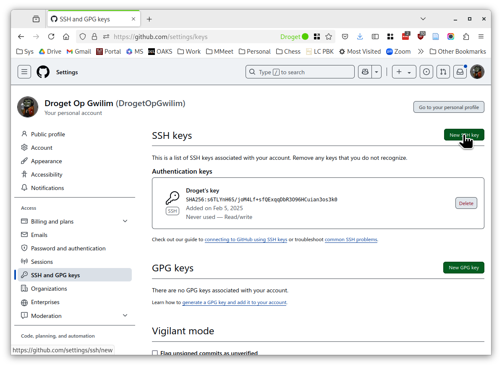

# SSH and GitHub

## Overview

Secure Shell (SSH) is a tool for connecting securely to a variety of computing systems, and it can be used to streamline interaction with GitHub.
The most straightforward way to use SSH is through a terminal emulator, also known as a command-line shell, or just a shell.

## Preliminaries

You need to have a functioning terminal emulator app and the SSH *client* software.
The SSH client software allows you to access remote machines.

FYI:
To interact with GitHub, you don't need to install SSH *server* software on your machine.
Installing SSH server software would allow you to use SSH from another machine to access your machine remotely.

### Windows

SSH client software should be installed already.
If you're running Windows 11, the Microsoft terminal app is probably already installed.
If you're running Windows 10, you might have to install it from the MS App store.
It's free.


Then launch it.


### Mac OS/X

A terminal app and SSH should be installed already.


### Linux

Surely a terminal emulator is installed already.
Use your desktop interface to launch it.

## Creating an SSH key pair for GitHub

The procedure to create an SSH key pair is essentially the same on all operating systems.
At the terminal command line, enter these commands

```
cd ~/.ssh
ssh-keygen
```

The `ssh-keygen` command will ask you

```
Enter file in which to save the key:
```

I suggest you call it `github_ed25519`.

It will ask you to enter a passphrase.
As a security feature, the terminal will *not* display the characters as you type a password, but it is recording them.
Just type your passphrase and press enter.

It will ask you to type it again, just to be sure it was entered correctly.
Type it again and press enter.

If all goes well, `ssh-keygen` will create the key pair,
then display some information about it.

You can run the command `ls` to list files in the current directory.
You should see at least the two files `github_ed25519` and `github_ed25519.pub`.


## What to do with the key pair

The file `github_ed25519` is the *private* key.
Leave it in the folder `.ssh` where it is.
You can copy it to the corresponding folder on another machine if you plan to use GitHub from there as well.
Keep this and the passphrase file secret.
The private key is encrypted with that passphrase, and can't be used without it.

The file `github_ed25519.pub` is the corresponding *public* key.
There's no need to keep it secret.
You can give this key to a remote system, and when you use an SSH client to connect to that remote system, the client uses the corresponding private key file to authenticate you to that remote system, so you won't use a password to log in to that remote system.
You will occasionally need to enter the passphrase you used when you created the key pair so that the client software can access it.
Your desktop interface usually has ways to do that when you log in to your machine, which makes the private key accessible for a while without needing your passphrase.
That way, you can use it as many times as you need to use the remote system.

The public key is just a line of text.
At the command line, you can use

```
cat gitub_ed25519.pub
```

to display it.
The terminal app will let you select that text and copy it.
You can also open the file in any text editor and copy it.

To give the public key to GitHub, sign in to your account.
Click your avatar in the upper right, and go to the Settings item in the menu.


Look for the item "SSH and GPG keys" on the left side of the settings page.


In the upper right, click "New SSH key".



Enter a name for the key.
Choose "Authentication Key" for the type.

In the big text area, paste the contents of the file `gitub_ed25519.pub`, which you can copy from the terminal or a text editor.
Paste the entire line.
It should begin with `ssh-ed25519` and end with an account name.
Then click "Add SSH key".


GitHub will ask for your password, and once you enter that, your public key will be added.


You can add multiple keys if needed, and you can delete keys from the same page.

## Using SSH with GitHub

Once your key is registered with GitHub, you can use it to make local clones of repositories.
You can then push changes to GitHub, and you only have to type the password to unlock your private key every once in a while.
The key should be used automatically in any application that uses Git.

You often need the SSH URL for a repository instead of the usual `https:` URL.
To get it, open the repository in GitHub.
Click the "Code" button to open the panel, make sure you're seeing the "Local" tab, and click the `SSH` subtab.
Click the copy icon (looks like two squares) to copy the text of the SSH URL form that you see in the text box.
It has the form `git@github.com:<repository-name>.git`.


### Using GitHub Desktop to create a local clone

Sign in to GitHub Desktop.
Find your repository.
Or, click on the tab to enter a URL, and paste the SSH URL copied from the GitHub web page.

### Using GitHub Desktop to update a local clone's upstream URL

If you created a local clone of a repository using the `https:` URL, some programs, such as MATLAB, might still try to use GitHub password authentication for pushing commits.
You can switch the repository over to using the SSH URL like this.

In GitHub Desktop, open the "Repository" menu and choose "Repository settings...".

Go to GitHub on the web and copy the SSH URL for your repository.
In the Remote panel, where it says "Primary remote repository (origin) URL",


remove the `https://...` text and paste the SSH URL `git@...`.


Then click "Save."


### Using `git` directly to create a local clone

To make a local clone using `git` from the command line, go to the repository in GitHub and copy the SSH URL.
At the command line, use `cd` to go to the folder where you want to create the local clone.
Then type

```
git clone <paste ssh-url here>
```

and press enter.

### Register SSH keys with MATLAB

MATLAB sometimes doesn't pick up on the correct key pair to use.
If it gives you error messages about keys not being set up, here's what to do.

Figure out where your key files are.
This should be your home directory, which usually looks like
`C:\Users\<name>\.ssh\` on Windows,
`/Users/<name>/.ssh` on OS/X,
and
`/home/<name>/.ssh` on Linux.

In the MATLAB command window, enter

```
git = settings().matlab.sourcecontrol.git;
git.PrivateKeyFile.PersonalValue = "<your-ssh-directory>/github_ed25519";
git.PublicKeyFile.PersonalValue = "<your-ssh-directory>/github_ed25519.pub";
git.KeyHasPassphrase.PersonalValue = true;
```
